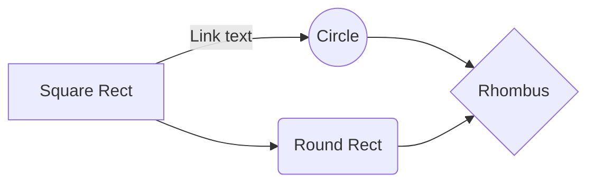

In most programming languages, we may author a function that takes an **input** and produces some **output**. 


We can say that our code answers the following question:

> Given a light color and an action, what happens to the color of the light?

And it answers it well! We can test its behavior, give it some types, whatever we want - to get a solid answer. We can compose these questions to ask more interesting ones:

> If I wait twice at a green light, what will the color of the light be?

```js
console.log(
	getLightColor(
		getLightColor("green", "wait"),
		"wait"
	)
) // => "red"
```

But if I asked another question:

> What color should the light be such that if I wait, it will turn red?

We're no longer asking a question in terms of its **input** (which is easy!), but its **output**. 

We may intuit a diagram such as the following:


<!--stackedit_data:
eyJoaXN0b3J5IjpbNzUwMjAzMTgyLDE4Mjg3MTAzNjQsLTk3Mz
A1NjU3NF19
-->